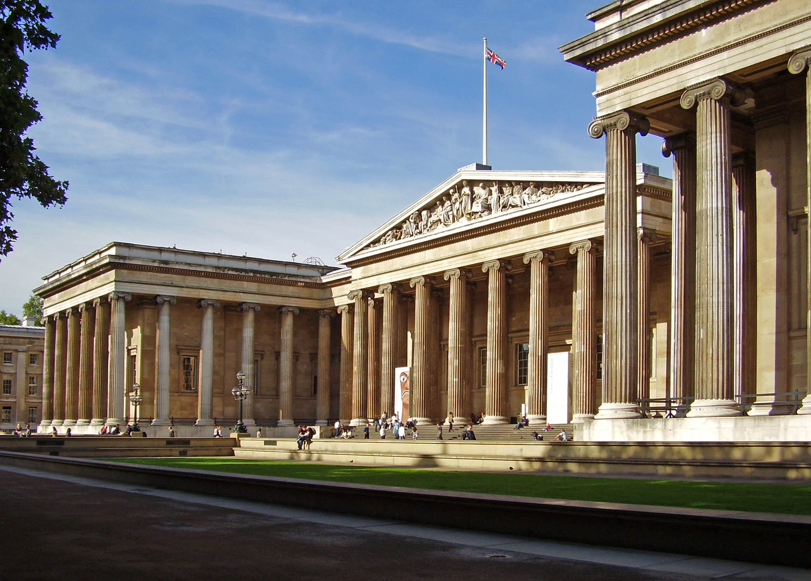

<!DOCTYPE html>
<html lang="en">
<head>
    <meta charset="UTF-8">
    <meta name="viewport" content="width=device-width, initial-scale=1.0">
    <title>Найвідоміші музеї світу</title>
    <link rel="stylesheet" href="https://maxcdn.bootstrapcdn.com/bootstrap/4.0.0/css/bootstrap.min.css">
    <link rel="stylesheet" href="styles.css">
    
    
    
    
</head>
<body>

<header>
    

        
        <nav>
            <ul>
                <li><a href="#about">Про сайт</a></li>
                <li><a href="#gallery">Галерея картинок</a></li>
                <li><a href="#news">Новини</a></li>
                <li><a href="#contacts">Контакти</a></li>
            </ul>
        </nav>
    

</header>

<main>
    <!-- Слайдер -->
    

        <ol class="carousel-indicators">
            <li data-target="#carouselExampleIndicators" data-slide-to="0" class="active"></li>
            <li data-target="#carouselExampleIndicators" data-slide-to="1"></li>
            <li data-target="#carouselExampleIndicators" data-slide-to="2"></li>
        </ol>
        

            

                
            

            

                
            

            

                
            

        

        <a class="carousel-control-prev" href="#carouselExampleIndicators" role="button" data-slide="prev">
            
            Previous
        </a>
        <a class="carousel-control-next" href="#carouselExampleIndicators" role="button" data-slide="next">
            
            Next
        </a>
    

    <!-- Про сайт -->
    <section id="about">
        <h2>Про сайт</h2>
        
Ласкаво просимо на інформаційний портал про найвідоміші музеї світу! Ми є вашим провідником у світ культурної спадщини, де ви знайдете цікаві факти, захоплюючі виставки та останні новини з найпрестижніших музеїв усього світу. Від Лувру в Парижі до Музею Метрополітен у Нью-Йорку, ми розкажемо вам про найдивовижніші колекції мистецтва, архітектурні шедеври та унікальні виставки. Наш сайт пропонує глибокий занурення у світ культури та мистецтва, де кожен зможе знайти щось цікаве для себе. Долучайтеся до нашої подорожі і відкрийте для себе неймовірний світ музеїв!

    </section>

    <!-- Галерея картинок -->
    <section id="gallery">
        <h2>Галерея картинок</h2>
        

            
            
            
            <!-- додайте інші картинки за бажанням -->
        

    </section>

    <!-- Новини -->
    <section id="news" class="news-section">
        <h2>Новини</h2>
        <!-- Новина 1 -->
        <article>
            <h3>Відкриття нової виставки у Луврі</h3>
            
Музей Лувр у Парижі анонсував відкриття нової виставки "Скарби світового мистецтва", яка презентує вражаючу колекцію картин, скульптур і реліквій з усього світу. Виставка буде відкрита для відвідувачів з 1 червня.

            <!-- фото -->
            

                
                
                <!-- додайте інші фото за бажанням -->
            

        </article>
        <!-- Новина 2 -->
        <article>
            <h3>Музей Метрополітен: скарби світового мистецтва</h3>
            
У музеї Метрополітен можна знайти практично все: від артефактів палеоліту до предметів поп- арту. Є тут і колекції мистецтва Африки і Океанії, Близького Сходу і Єгипту, які сміливо можна назвати раритетом...

            <!-- фото -->
            

                
                
                <!-- додайте інші фото за бажанням -->
            

        </article>
        <!-- Новина 3 -->
        <article>
            <h3>Музей Ватикану: найбільший музей світу</h3>
            
Музей Ватикану — найбільший музей світу: 1400 залів, 50000 об’єктів, і щоб обійти всі представлені експонати треба пройти 7 км. Зрозуміло, всі відвідувачі першою справою прагнуть потрапити в Сикстинську капелу...

            <!-- фото -->
            

                
                
                <!-- додайте інші фото за бажанням -->
            

        </article>
        <!-- інші новини -->
        <article>
            <h3>British Museum: культурне скарбниця Великої Британії</h3>
            
British Museum — Британський музей в Лондоні — є одним з найбільших та найстаріших музеїв у світі. Заснований в 1753 році, він має в своєму зібранні понад 8 мільйонів артефактів, які охоплюють всю історію людства з давніх часів до сучасності.

            <!-- фото -->
            

                
                
                <!-- додайте інші фото за бажанням -->
            

        </article>
        <article>
            <h3>Національний музей Китаю: культурна спадщина Піднебесної</h3>
            
Національний музей Китаю в Пекіні є найбільшим музеєм в країні та одним з найбільших у світі. Він містить понад мільйон об’єктів, що охоплюють історію Китаю від давнини до сучасності.

            <!-- фото -->
            

                
                
                <!-- додайте інші фото за бажанням -->
            

        </article>
        <article>
            <h3>Уффіці: ренесансна скарбниця Флоренції</h3>
            
Уффіці в Флоренції є однією з найвідоміших художніх галерей у світі. Заснована в 1581 році, вона містить багатющу колекцію італійського ренесансного мистецтва, включаючи твори Леонардо да Вінчі, Мікеланджело, Рафаеля та Боттічеллі.

            <!-- фото -->
            

                
                
                <!-- додайте інші фото за бажанням -->
            

        </article>
    </section>

    <!-- Контакти -->
    <section id="contacts">
        <h2>Контакти</h2>
        
Для отримання додаткової інформації, будь ласка, зв'яжіться з нами:

        
Email: info@worldmuseums.com

        
Телефон: +123 456 7890

        <!-- Карта Google -->
        

        
        
    </section>
</main>

<footer>
    

        
&copy; 2024 Найвідоміші музеї світу. Всі права захищені.

    

</footer>

</body>
</html>
